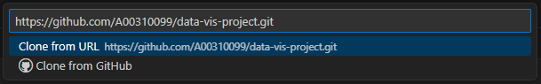

# Data Visualisation Project: Food Price and poverty in the European Union visualized

## Quickstart
1. Download the [Python](https://marketplace.visualstudio.com/items?itemName=ms-python.python) and [Jupyter](https://marketplace.visualstudio.com/items?itemName=ms-toolsai.jupyter) extensions for [Visual Studio Code](https://code.visualstudio.com/Download).
2. Clone this repository and start your Python virtual environment.
3. Download the datasets by following the instructions in [`data/README.md`](data\README.md).
4. Make sure all required packages are installed:
`pip install -r requirements.txt`
5. Run [`src/datavis.py`](src/datavis.py).

For more detailed instructions, refer to the [Reproduction Steps](#reproduction-steps) below.

## Project Structure
- [`README.md`](README.md) with quickstart, project structure, and reproduction steps.
- [`requirements.txt`](requirements.txt) with required Python packages.
- [`data/`](data) with README on how to obtain raw data. Downloaded data is stored in this folder.
- [`src/`](src) containing the [`datavis.py`](src/datavis.py) Python script for visualising the data.

## Reproduction Steps
Our project was designed in Visual Studio Code. The following steps detail how to get our project up and running in Visual Studio Code. Other environments may work, but have not been tested and as such will not be mentioned here.

- [ ] **<ins>Prerequisites:</ins>**
    - If you do not already have Visual Studio Code installed, you can get it for your platform from the [Download Visual Studio Code page](https://code.visualstudio.com/Download).
    - Once you have downloaded and set up Visual Studio Code, you will need the Python and Jupyter extensions. The Python extensions can be installed [here](https://marketplace.visualstudio.com/items?itemName=ms-python.python) and the Jupyter extensions can be installed [here](https://marketplace.visualstudio.com/items?itemName=ms-toolsai.jupyter).
- [ ] **<ins>Importing the project:</ins>**
    - If you have [git](https://git-scm.com/) installed on your computer, you can clone this repository directly into Visual Studio Code.\
    \
    
    - Otherwise, you can download the repository as a `.zip` from the [GitHub](https://github.com/A00310099/data-vis-project), extract it where you can find it (for example, onto your desktop) and then Open Folder with Visual Studio Code.\
    

### (WORK IN PROGRESS)...