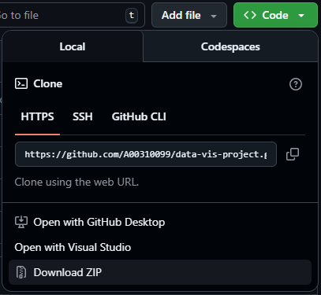
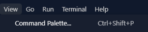
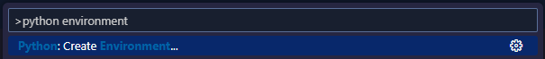
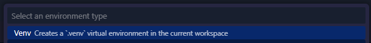
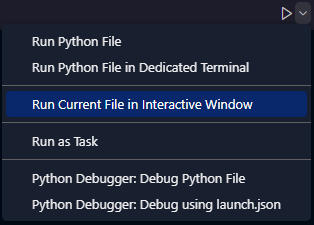
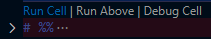

# Data Visualisation Project: Food Price and poverty in the European Union visualized

## Quickstart
1. Download the [Python](https://marketplace.visualstudio.com/items?itemName=ms-python.python) and [Jupyter](https://marketplace.visualstudio.com/items?itemName=ms-toolsai.jupyter) extensions for [Visual Studio Code](https://code.visualstudio.com/Download).
2. Clone this repository and start your Python virtual environment.
3. Make sure all required packages are installed:
`pip install -r requirements.txt`
4. Download the datasets by following the instructions in [`data/README.md`](data/README.md).
5. Run [`src/datavis.py`](src/datavis.py).

For more detailed instructions, refer to the [Reproduction Steps](#reproduction-steps) below.

## Project Structure
- [`README.md`](README.md) with quickstart, project structure, and reproduction steps.
- [`requirements.txt`](requirements.txt) with required Python packages.
- [`data/`](data) with README on how to obtain raw data. Downloaded data is stored in this folder.
- [`src/`](src) containing the [`datavis.py`](src/datavis.py) Python script for visualising the data.

## Reproduction Steps
> [!NOTE]
> Our project was designed in Visual Studio Code. The following steps detail how to get our project up and running in Visual Studio Code. Other environments may work, but have not been tested and as such will not be mentioned here. If you know what you are doing, you may wish to follow the [Quickstart](#quickstart) instead.

### <ins>Prerequisites:</ins>
- You will need to have [Python](https://www.python.org/downloads/) installed. The project was made with [Python 3.13.9](https://www.python.org/downloads/release/python-3139/), but other versions may work for you too.
- If you do not already have Visual Studio Code installed, you can get it for your platform from the [Download Visual Studio Code page](https://code.visualstudio.com/Download).
- Once you have downloaded and set up Visual Studio Code, you will need the Python and Jupyter extensions. The Python extensions can be installed [here](https://marketplace.visualstudio.com/items?itemName=ms-python.python) and the Jupyter extensions can be installed [here](https://marketplace.visualstudio.com/items?itemName=ms-toolsai.jupyter).
### <ins>Importing the project:</ins>
- If you have [git](https://git-scm.com/) installed on your computer, you can clone this repository directly into Visual Studio Code.\
\

- Otherwise, you can download the repository as a `.zip` from the [GitHub](https://github.com/A00310099/data-vis-project), extract it where you can find it (for example, onto your desktop) and then Open Folder with Visual Studio Code.\
\


### <ins>Project setup:</ins>
- Before you can run the project, you will need to start a Python Virtual Environment. You can do this by opening the Command Palette in Visual Studio Code, either through `View > Command Palette...` or with the <kbd>F1</kbd> or <kbd>Ctrl</kbd>+<kbd>Shift</kbd>+<kbd>P</kbd> shortcuts.\

- From the Command Palette, you can then run the `Create: Python Environment...` command. Select `.venv` as your virtual environment, then the version of python you are using.\
\

- At this point, you might be asked if you'd like to install packages from requirements.txt. Approve the prompt and Visual Studio Code will install the required packages for you. If you do not get this prompt, or if you declined it, you will need to open a terminal in your virtual environment and run the following command:
    ```
    pip install -r requirements.txt
    ```
- You will also want to download the required datasets for the project. [`data/README.md`](data/README.md) contains detailed instructions on how you can do this on Linux and on Windows.

### <ins>Running the project:</ins>
- Once you've completed all the steps, you may now run `datavis.py`. Do not try running this by just pressing the run button. Instead, click the dropdown next to the run button and select `Run Current File in Interactive Window`. This may take a few seconds to fully load, but once it does you should see all the graphs begin to open up at the side.\

- Once you've ran the file at least once, you may later want to narrow down your results. You can view individual graphs by clicking on the `Run Cell` button above blocks of codes.\

